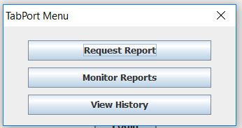
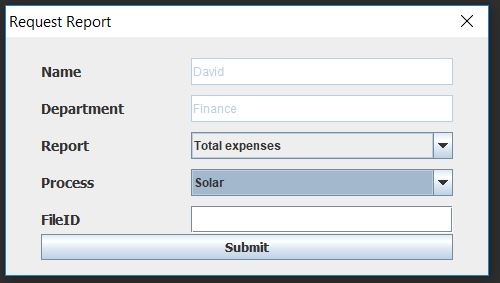
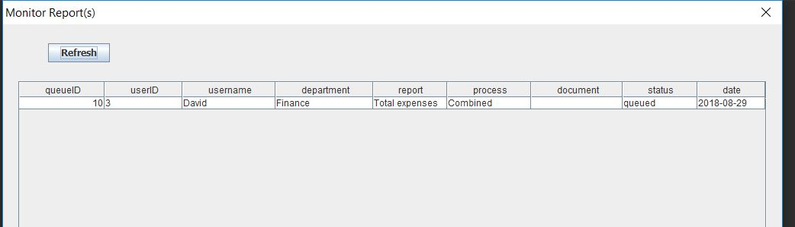

# TabPort 
A process was needed to create reports for confidential data which were not published on Tableau server. 
TabPort was created for those departments who had confidential data and were reluctant to publish any data or 
visualization for public consumption. Through TabPort only limited number of people and executives could request and view the report.  

In the main menu page user was able to choose one of the three options  
1)	Request Report: Request for new report 
2)	Monitor Report: Find out the status of a recently submitted report by user 
3)	View History: Find all the reports that were requested by anyone in the user’s department 
 
  
  
  
